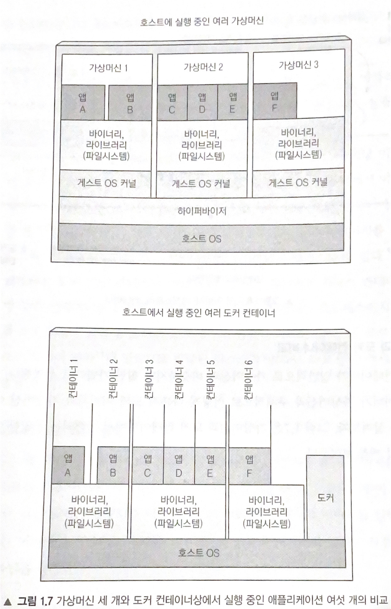
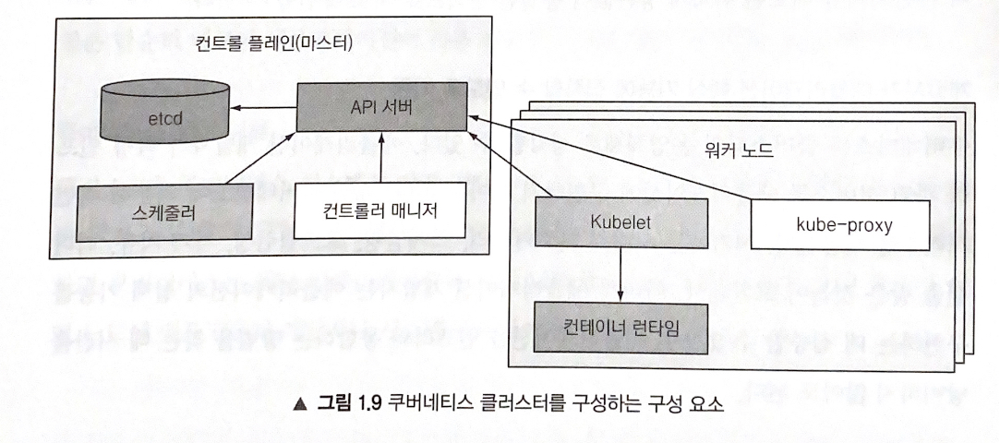

# 1장 쿠버네티스 소개

### 1. 쿠버네티스가 생긴 이유
- Application이 거대해지면서, MSA로 세분화 함과 동시에 인프라 변경이 필요하기 때문이다.

- Application의 기능이 많아지면서, 모놀로스 Application의 단점인 상호의존성이 증가하고, 한번 재부팅 시 많은 Resource 가 소모된다. 또한, 트래픽이 증가할 때 상대적으로 비용이 저렴한 Scale out 을 하기 힘들다는 점이 부각되었기 때문이다.

- 모놀로스 Application에서 MSA로 세분화 하게 되면서, 각 Server마다 개발 환경이 다른 상황이 발생할 수 있다. Application에 일관적인 환경을 제공하기 위해서 필요성이 증대 되었다.

- 과거에는 개발팀이 Application 개발을 한 뒤 운영팀에 넘겨주어 각자의 역할을 분배해서 프로젝트를 진행했지만, 이제는 개발팀이 Application을 배포하고, 관리하는것이 더 낮다는 점을 깨달았다.

>위의 이유를 통해 kubernetes가 등장하게 되었다.

### 2. container의 등장
- 컨테이너란, 동일한 호스트 시스템에 여러개의 서비스를 실행할 수 있다. 또한, 동시에 서로 다른 환경을 만들어 준다.

- 같은 역할을 하는 가상머신과의 차이점은 host OS와 동일한 커널에서 시스템 콜이 수행된다. 그 결과 하드웨어 에뮬레이트 단계가 없이 분리된 공간을 만들기 때문에 가상머신에 비해 오버헤드가 적다.

- 컨테이너 격리를 가능하게 해주는 매커니즘은 두가지가 있다.
    1. 리눅스 네임 스페이스(namespace)
        - 각 프로세스가 시스템에 대한 독립된 뷰만 볼수 있도록 한다.
        - 네임 스페이스의 종류는 마운트(mnt), 프로세스ID(pid), 네트워크(net), 프로세스간 통신(ipc), 호스트와 도메인 이름(uts), 사용자ID(user) 로 구성되어있다.
        - 
    2. 리눅스 컨트롤 그룹(cgroups)
        - 프로세스가 사용할 수 있는 리소스의 양을 제한한다.
        - 리소스는 CPU, 메모리, 네트워크 대역 등이 있다.

### 3. 도커(Docker) 컨테이너 플랫폼 소개
- 도커란
    - 컨테이너를 여러 시스템에 쉽게 이식 가능하게 하는 최초의 컨테이너 시스템
    - 애플리케이션, 라이브러리, 여러 종속성, 파일시스템 등 패키징하는 과정 단순화
    - 리눅스 컨테이너 기술로 가상머신과 거의 동일한 수준의 격리 제공
    - 애플리케이션을 패키징, 배포, 실행하기 위한 플랫폼

- 도커의 세 가지 주요 개념은 다음과 같다.
    - *이미지* : 애플리케이션과 해당 환경을 패키지화 한 것이다.
    - *레지스트리* : 도커 이미지를 저장하고 다른 사람이나 컴퓨터 간에 해당 이미지를 쉽게 공유할 수 있는 저장소다.
    - *컨테이너* : 도커 기반 컨테이너 이미지에서 생성된 일반적인 리눅스 컨테이너다.

- 도커 이미지의 빌드, 배포, 실행

- 가상머신과 도커 컨테이너 비교

    - 가상머신은 호스트OS 위 하이퍼바이저가 있고 그 위에서 게스트OS가 있다.
    - 컨테이너는 호스트OS 커널을 공유하여 시스템 콜을 수행한다.
    - 참고 링크 : [컨테이너와 가상 머신 비교](https://docs.microsoft.com/ko-kr/virtualization/windowscontainers/about/containers-vs-vm)

### 4. 쿠버네티스 소개
- 쿠버네티스는 컨테이너화된 애플리케이션을 쉽게 배포하고 관리할 수 있게 해주는 소프트웨어 시스템이다.
- 리눅스 컨테이너의 기능에 의존해 애플케이션 내부 세부 사항을 알 필요없이, 각 호스트에 애플리케이션을 수동으로 배포하지 않고도 이기종 애플리케이션을 실행할 수 있다.
- 개발자가 애플리케이션 핵심 기능에 집중할 수 있도록 서비스 디스커버리, 스케일링, 로드밸런싱, 자가 치유, 리더 선출 등을 지원한다.

- 쿠버네티스 클러스터 아키텍처
    - 쿠버네티스 클러스터는 여러 노드로 구성되며, 두 가지 유형으로 나눌 수 있다.
        - 마스터 노드 : 전체 쿠버네티스 시스템을 제어하고 관리하는 쿠버네티스 *컨트롤 플레인*을 실행한다.
        - 워커 노드 : 실제 배포되는 컨테이너 애플리케이션을 실행한다.

        
    - 컨트롤 플레인
        - 쿠버네티스 API 서버는 사용자, 컨트롤 플레인 구성 요소와 통신한다.
        - 스케줄러는 애플리케이션의 배포를 담당한다.
        - 컨트롤러 매니저는 구성 요소 복제본, 워커 노드 추적, 노드 장애 처리 등과 같은 클러스터단의 기능을 수행한다.
        - Etcd는 클러스터 구성을 지속적으로 저장하는 신뢰할 수 있는 분산 데이터 저장소다.
    
    컨트롤 플레인의 구성 요소는 클러스터 상태를 유지하고 제어하지만 애플리케이션을 실행하진 않는다. 이는 노드에 의해 이뤄진다.

    - 노드
        - 컨테이너를 실행하는 도커, rkt 또는 다른 컨테이너 런타임
        - API 서버와 통신하고 노드의 컨테이너를 관리하는 Kubelet
        - 애플리케이션 구성 요소 간에 네트워크 트래픽을 로드밸런싱하는 쿠버네티스 서비스 프록시

- 쿠버네티스에서 애플리케이션 실행
    - 애플리케이션을 하나 이상의 컨테이너 이미지로 패키징하고 해당 이미지를 이미지레지스트리로 푸시한 다음 쿠버네티스 API 서버에 애플리케이션 디스크립션을 게시해야 한다.

- 실행된 컨테이너 유지
    - 애플리케이션이 실행되면 쿠버네티스는 애플리케이션의 배포 상태가 사용자가 제공한 디스크립션과 일치하는지 지속적으로 확인한다.
    - 프로세스가 중단되거나 응답이 중지될 때와 같이 인스턴스가 제대로 작동하지 않으면 쿠버네티스가 자동으로 다시 시작한다.
    - 워커 노드 전체가 종료되거나 액세스할 수 없게 되면 쿠버네티스는 이 노드에서 실행 중인 모든 컨테이너의 노드를 새로 스케줄링하고, 새로 선택한 노드에서 실행한다.

- 복제본 수 스케일링
    - 애플리케이션이 실행되는 동안 복제본 수를 늘릴지 줄일지 결정 가능.
    - CPU 부하, 메모리 사용량, 초당 요청 수 등 실시간 메트릭을 기반으로 복제본 수를 자동으로 조정할 수 있다. (오토스케일링)

### 5. 요약
- 모놀리스 애플리케이션은 구축하기 쉽지만 시간이 지남에 따라 유지 관리하기가 더 어려워지고 때로는 확장이 불가능할 수 있다.
- 마이크로서비스 기반 애플리케이션 아키텍처는 각 구성 요소의 개발을 용이하게 하지만 하나의 시스템으로 작동하도록 배포하고 구성하기가 어렵다.
- 리눅스 컨테이너는 가상머신과 동일한 이점을 제공하지만 훨씬 더 가볍고 하드웨어 활용도를 높일 수 있다.
- 도커는 OS 환경과 함께 컨테이너화된 애플리케이션을 좀 더 쉽고 빠르게 프로비저닝할 수 있도록 지원해 기존 리눅스 컨테이너 기술을 개선했다.
- 쿠버네티스는 전체 데이터 센터를 애플리케이션 실행을 위한 컴퓨팅 리소스로 제공한다.
- 개발자는 시스템 관리자의 도움 없이도 쿠버네티스로 애플리케이션을 배포할 수 있다.
- 시스템 관리자는 쿠버네티스가 고장 난 노드를 자동으로 처리하도록 함으로써 더 편하게 잠을 잘 수 있다.
